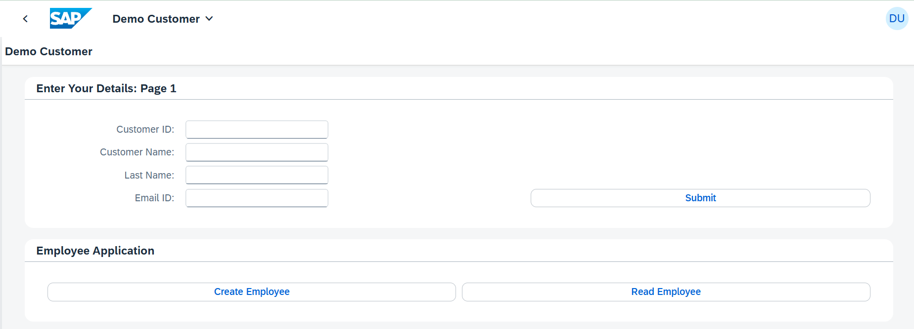
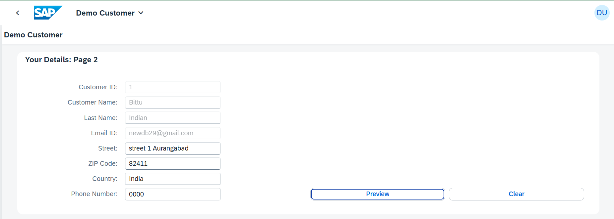

## Application Details
|               |
| ------------- |
|**Generation Date and Time**<br>Wed Aug 23 2023 20:18:59 GMT+0530 (India Standard Time)|
|**App Generator**<br>@sap/generator-fiori-freestyle|
|**App Generator Version**<br>1.10.5|
|**Generation Platform**<br>Visual Studio Code|
|**Template Used**<br>simple|
|**Service Type**<br>OData Url|
|**Service URL**<br>https://services.odata.org/V2/Northwind/Northwind.svc/
|**Module Name**<br>democustomer|
|**Application Title**<br>Demo Customer|
|**Namespace**<br>com.ib|
|**UI5 Theme**<br>sap_horizon|
|**UI5 Version**<br>1.117.0|
|**Enable Code Assist Libraries**<br>False|
|**Enable TypeScript**<br>False|
|**Add Eslint configuration**<br>False|

## democustomer

A Fiori application demo customer

### Starting the generated app

-   This app has been generated using the SAP Fiori tools - App Generator, as part of the SAP Fiori tools suite.  In order to launch the generated app, simply run the following from the generated app root folder:

```
    npm start
```

- It is also possible to run the application using mock data that reflects the OData Service URL supplied during application generation.  In order to run the application with Mock Data, run the following from the generated app root folder:

```
    npm run start-mock
```

#### Pre-requisites:

1. Active NodeJS LTS (Long Term Support) version and associated supported NPM version.  (See https://nodejs.org)

## Demo
- Page 1:


- Page 2:

